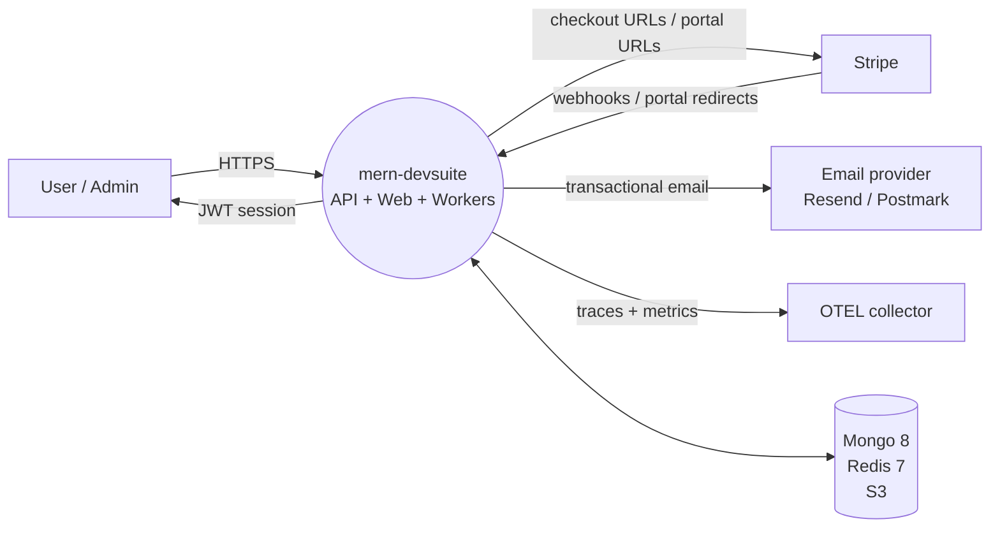
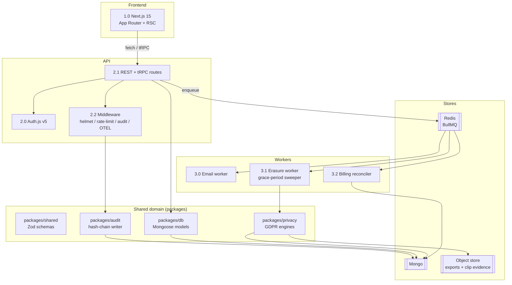
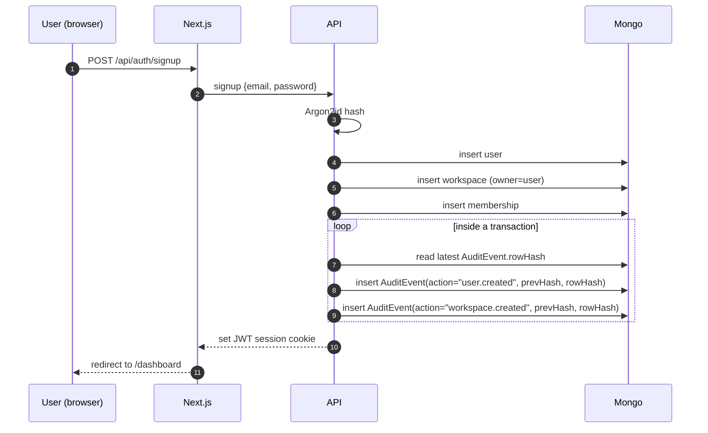
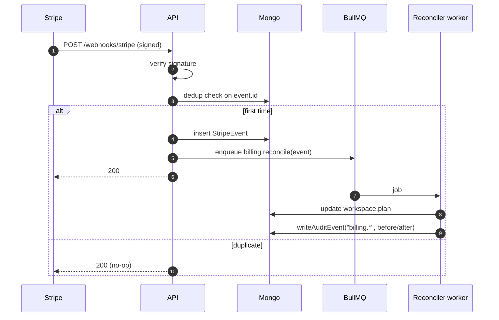
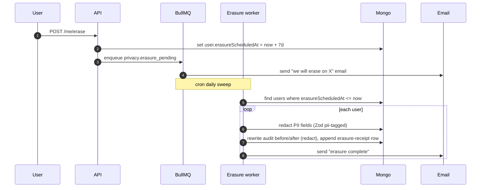
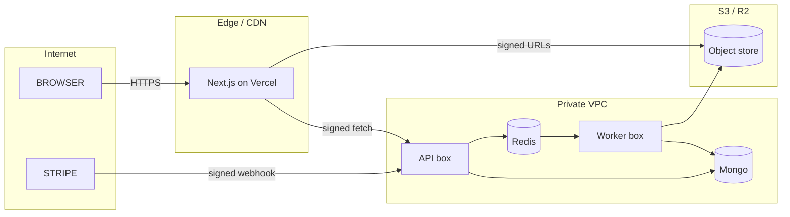

# DFD — mern-devsuite

## Level 0 — Context

## Level 1 — Service decomposition

## Level 2 — Signup to first audit row

## Level 2 — Stripe webhook reconciliation

## Level 2 — GDPR erasure with grace period

## Data stores

| Store | Collections / keys | Purpose | Retention |
|-------|--------------------|---------|-----------|
| Mongo `users` | users | Accounts | Until erasure |
| Mongo `workspaces` | tenants | Billing + plan | Until deleted |
| Mongo `memberships` | user↔workspace | Roles | Until removed |
| Mongo `audit_events` | hash-chained log | Evidence | 7 years default |
| Mongo `stripe_events` | dedup cache | Webhook idempotency | 30 days |
| Redis (BullMQ) | queues | Async jobs | Per-queue TTL |
| S3 `exports/` | per-request zip | GDPR Art. 20 | 7 days signed URL |

## Trust boundaries

## Invariants & contracts

- Every mutating HTTP handler writes **exactly one** audit row per logical action.
- Audit rows are append-only; the hash chain is verified nightly.
- Stripe events are processed at-least-once; handler is idempotent via dedup table.
- PII schema tags are the source of truth for both export (Art. 20) and erasure (Art. 17).
- Every `/api/*` route has a Zod schema; invalid payloads return 400 before any DB call.
